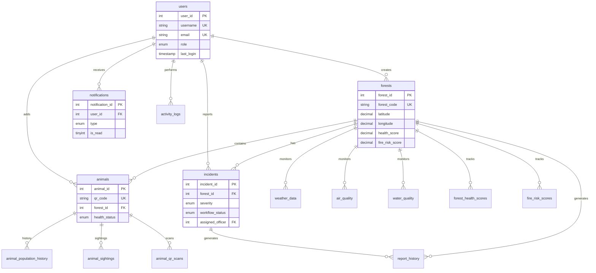
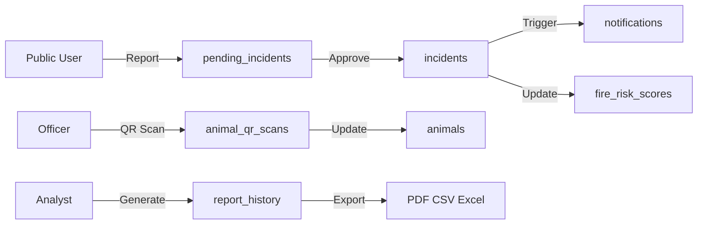

# Entity Relationship Diagram

```mermaid
erDiagram
    users ||--o{ forests : creates
    users ||--o{ animals : adds
    users ||--o{ incidents : reports
    users ||--o{ notifications : receives
    users ||--o{ activity_logs : performs
    
    forests ||--o{ animals : contains
    forests ||--o{ incidents : has
    forests ||--o{ weather_data : monitors
    forests ||--o{ air_quality : monitors
    forests ||--o{ water_quality : monitors
    forests ||--o{ forest_health_scores : tracks
    forests ||--o{ fire_risk_scores : tracks
    
    animals ||--o{ animal_population_history : history
    animals ||--o{ animal_sightings : sightings
    animals ||--o{ animal_qr_scans : scans
    
    incidents ||--o{ report_history : generates
    forests ||--o{ report_history : generates
    
    users {
        int user_id PK
        string username UK
        string email UK
        enum role
        timestamp last_login
    }
    
    forests {
        int forest_id PK
        string forest_code UK
        decimal latitude
        decimal longitude
        decimal health_score
        decimal fire_risk_score
    }
    
    animals {
        int animal_id PK
        string qr_code UK
        int forest_id FK
        enum health_status
    }
    
    incidents {
        int incident_id PK
        int forest_id FK
        enum severity
        enum workflow_status
        int assigned_officer FK
    }
    
    notifications {
        int notification_id PK
        int user_id FK
        enum type
        tinyint is_read
    }
```

## Data Flow

```mermaid
flowchart LR
    A[Public User] -->|Report| B[pending_incidents]
    B -->|Approve| C[incidents]
    C -->|Trigger| D[notifications]
    C -->|Update| E[fire_risk_scores]
    F[Officer] -->|QR Scan| G[animal_qr_scans]
    G -->|Update| H[animals]
    I[Analyst] -->|Generate| J[report_history]
    J -->|Export| K[PDF CSV Excel]
```
